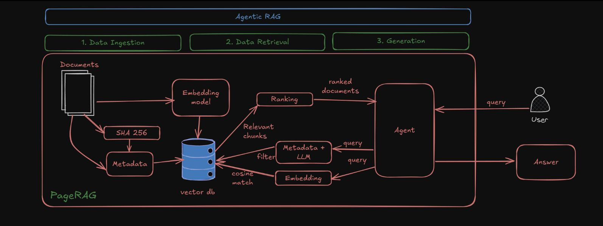
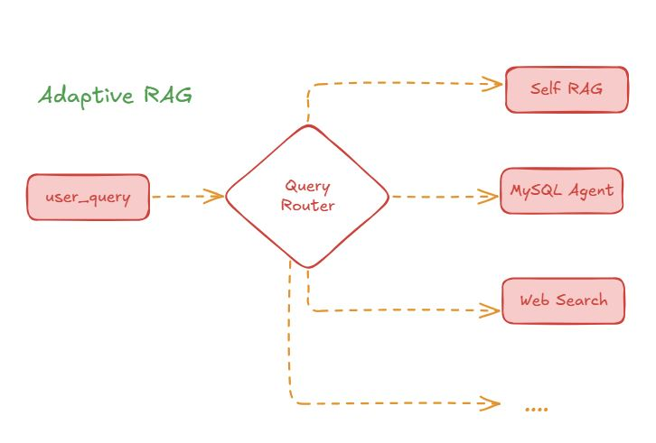
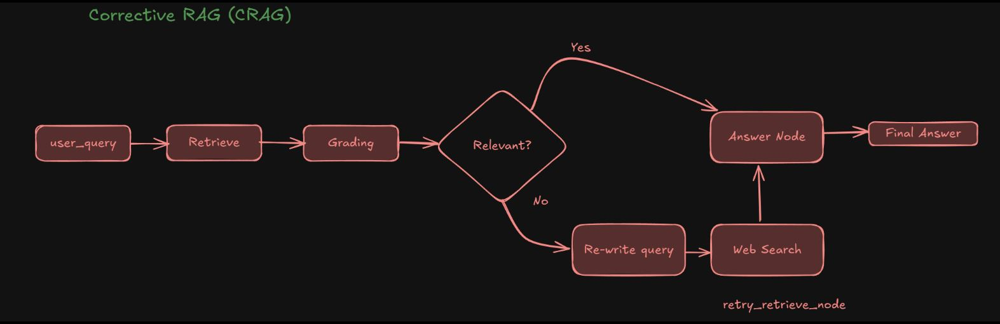
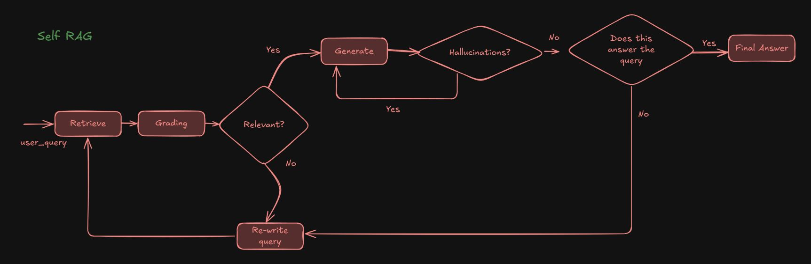

# 🚀 Adaptive Agentic RAG System for Intelligent Document Processing

>** 🔍 A Retrieval-Augmented Agentic Framework for automating Business Requirement Document (BRD) generation from heterogeneous enterprise data. **

---

## 📌 📖 Overview

This project presents an **Adaptive Agentic Retrieval-Augmented Generation (RAG) Framework** designed to process and extract meaningful insights from diverse enterprise data sources such as PDFs, databases, and web data.

Traditional document processing is:
- ❌ Manual  
- ❌ Time-consuming  
- ❌ Error-prone  

This system introduces:
- ✅ Intelligent retrieval  
- ✅ Context-aware generation  
- ✅ Multi-source query routing  
- ✅ Agent-based reasoning  

---

## ⚠️ IMPORTANT NOTE (Execution)

> ⚠️ This project is implemented and tested in **Google Colab** to ensure it runs on any system regardless of GPU availability.

If you want to run this project, follow the steps below:

---

## ▶️ How to Run (Google Colab Setup)

### 1️⃣ Open Google Colab
Go to: https://colab.research.google.com/

---

### 2️⃣ Load the Repository Notebook
- Open your GitHub repository
- Navigate to:
- Open it in Colab

---

### 3️⃣ Configure API Keys
Set required environment variables:

```python
import os
os.environ["LANGSMITH_API_KEY"] = "your_api_key"
```
---

### 4️⃣ Clone Repository in Runtime
```Bash
!git clone <your-repo-url>
%cd <repo-folder>
```
---

### 5️⃣ Upload Database (for SQL Routing)
```python
from google.colab import files
files.upload()
```
📌 You can upload any .db file to test SQL-based queries.

---

### 6️⃣ Install Requirements
```Bash
pip install -r requirements.txt

```

---

### 7️⃣ Run the System
```python
agent.invoke({"messages": [HumanMessage("your query")]})

```

---

## 📌 Problem Statement

Enterprise environments deal with:

📄 Multiple document formats (PDF, Word, Excel, emails)
⏳ Slow BRD creation (20–30 days)
❌ Inconsistent outputs
⚠️ Human errors in requirement extraction

## 💡 Solution
 🚀 An AI-powered multi-agent RAG system that:

Automates document understanding
Extracts relevant information using semantic search
Dynamically routes queries
Generates grounded, structured responses

---

## 🧠 System Architecture

---

User Query
     ↓
Query Router 🧠
     ↓
 ┌───────────────┬───────────────┬───────────────┐
 │ Document RAG  │ SQL Database  │ Web Search    │
 │ (Vector DB)   │ (Structured)  │ (Realtime)    │
 └───────────────┴───────────────┴───────────────┘
     ↓
Retriever → Generator → Validator → Final Answer

--



---



---



---



---

## ⚙️ Key Features
✅ Multi-source Query Routing (Docs / SQL / Web)
✅ Semantic Search using Vector Embeddings
✅ Agentic Workflow (LangGraph-based)
✅ Context-Aware Answer Generation
✅ Hallucination Reduction
✅ Modular & Scalable Architecture

## 🧩 RAG Strategies Implemented

### 🟢 1. Agentic RAG

✔ Multi-step reasoning
✔ Task decomposition
✔ Modular execution

### 🟡 2. Corrective RAG

✔ Filters irrelevant documents
✔ Uses fallback strategies (Web Search)
✔ Improves reliability

### 🔵 3. Self-RAG

✔ Decides when retrieval is needed
✔ Avoids unnecessary context

### 🟣 4. Reflexion RAG

✔ Iterative refinement
✔ Feedback-driven improvement

### 🔶 5. Adaptive RAG (Core Contribution)

✔ Dynamic query routing
✔ Multi-source integration
✔ Handles diverse query types

---

## 🔄 Workflow

User submits query
Query is classified
Routed to appropriate source:
    📄 Documents (Vector DB)
    🗄️ SQL Database
    🌐 Web Search
Relevant data is retrieved
LLM generates grounded response
Validation ensures correctness

---

## 🧪 Evaluation Metrics
✅ Retrieval Relevance
✅ Response Accuracy
✅ Context Utilization
✅ Query Routing Accuracy
✅ Response Coherence
⚠️ Response Time (Web slower)

---

## 📊 Performance Insights
📄 High accuracy for document-based queries
🗄️ Fast and precise SQL responses
🌐 Web queries depend on external data quality

---

## 📂 Project Structure

RAG-Project/
│
├── config.py
├── README.md
├── requirements.txt
├── .gitignore
│
├── data/                  # Input PDFs
├── db/                    # Database (optional)
├── Architecture_Diagrams/                  
├── Literature_Documents/
├── Reference_Research_Papers/
│
├── scripts/
│   ├── data_ingestion.py
│   ├── nodes.py
│   ├── utils.py
│   ├── mytools.py
│   ├── mysql_tools.py
│
├── notebooks/
│   └── initial_setup.ipynb
│
├── debug_logs/

---

## ⚙️ Tech Stack
📌 Python3
🧠 LLM: Ollama (Qwen / Gemma)
🔍 Vector DB: ChromaDB
🔗 Framework: LangChain + LangGraph
🗄️ Database: SQLite
🌐 Web Search: DuckDuckGo (DDGS)

---

## ⚠️ Limitations
❌ Retrieval depends on embedding quality
❌ Semantic queries may fail if chunks mismatch
❌ No structured BRD output yet
❌ Limited reasoning depth

---

## 🚀 Future Work
🔧 Hybrid Retrieval (BM25 + Vector)
📄 Automated BRD generation
🧠 Advanced reasoning agents
🌐 Improved query classification

---

## 🏁 Conclusion

This project demonstrates how combining:

Retrieval
Generation
Agentic workflows

can significantly improve:

✅ Accuracy
✅ Efficiency
✅ Scalability

in enterprise document processing systems.

---

# 👨‍💻 Author

** Akshay Kale **
** IIT Jodhpur **

# 📜 License

MIT License

# ⭐ Final Note

✔ This system avoids hallucination and prioritizes factual grounding
⚠️ Performance depends on retrieval quality
🚀 Designed for real-world enterprise scalability

